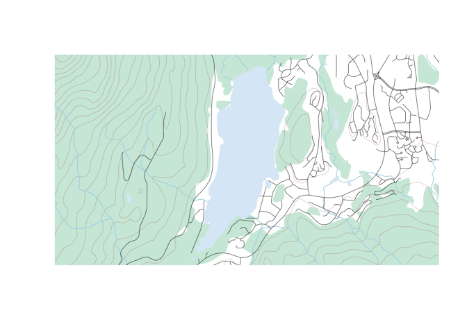
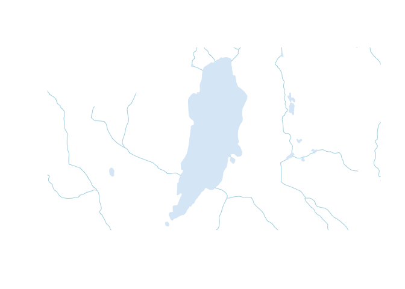
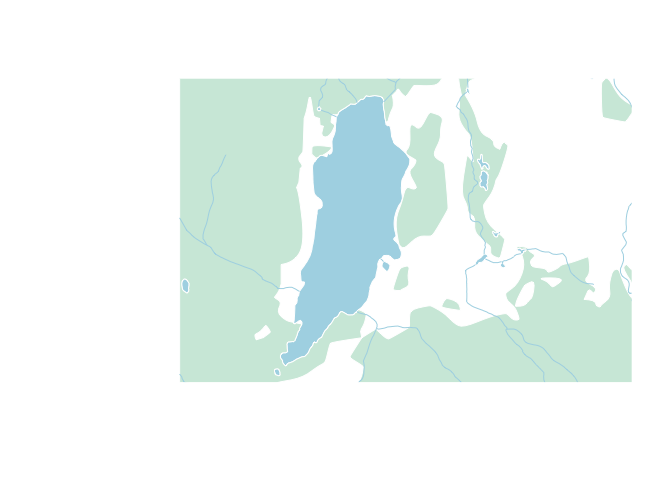
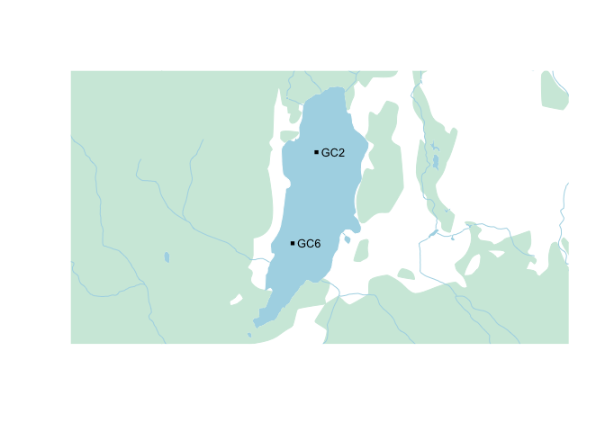
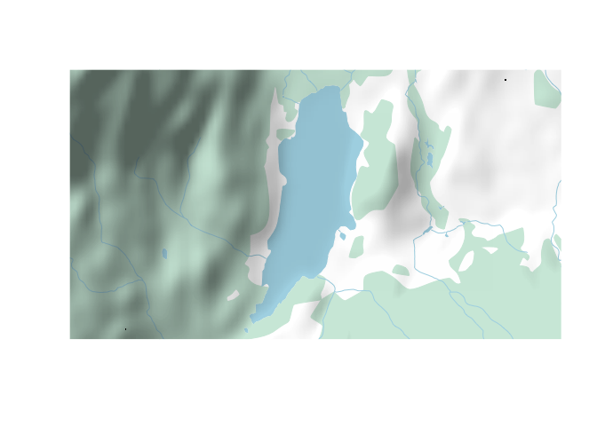

CanVec Data in R
================

[](https://cran.r-project.org/package=rcanvec)

An R package to access and plot CanVec and CanVec+ data for rapid basemap creation in Canada

**NOTE**: If you're getting all kinds of warnings about how your sheet may not exist, you need to upgrade to the newest version of `rcanvec`! GeoGratis changed the download directory for sheets organized in this way such that an update is required to access the information.

{ranvec} provides an interface to the National Topographic System (NTS), which is the way in which a number of freely available Canadian datasets are organized. CanVec and CanVec+ datasets, which include all data used to create Canadian topographic maps, are two such datasets that are useful in creating vector-based maps for locations across Canada. This packages searches CanVec data by location, plots it using pretty defaults, and exports it to human-readable shapefiles for use in another GIS.

Installation
------------

The rcanvec package is [available on CRAN](https://cran.r-project.org/package=rcanvec) and can be installed using `install.packages("rcanvec")`. The manual is [also available on the CRAN website](https://cran.r-project.org/web/packages/rcanvec/rcanvec.pdf).

Exporting CanVec data
---------------------

If you're like me, you'll probably want to make a map in some program other than R ([QGIS](http://www.qgis.org/) is my personal favourite). You can do this easily using the `canvec.export()` function. The function combines all the NTS sheets you pass into it and exports to a folder of your choosing (with nice human-readable names!). We're going to use the [prettymapr package](http://paleolimbot.github.io/prettymapr) to help with a few things as well.

``` r
library(rcanvec)
library(prettymapr)
altalake <- makebbox(50.1232, -122.9574, 50.1035, -123.0042)
```

``` r
canvec.download(nts(bbox=altalake))
canvec.export(nts(bbox=altalake), "canvec_data")
```

Finding your NTS Sheet
----------------------

These things called "paper maps" used to exist, each of which had a number (the ones we'll be looking at have the IDs "092J01" and "092J02"). The `nts()` function finds and/or parses these into series/area/sheet parameters so they can be used by the `canvec.*` functions (these numbers are how the Canadian government happens to organize this data). If this is confusing, don't worry and see the section below!

``` r
nts(bbox=altalake)
```

    ## [[1]]
    ## [1] "092" "J"   "03" 
    ## 
    ## [[2]]
    ## [1] "092" "J"   "02"

``` r
nts("92j1")
```

    ## [1] "092" "J"   "01"

``` r
nts("092J01", "092J02")
```

    ## [[1]]
    ## [1] "092" "J"   "01" 
    ## 
    ## [[2]]
    ## [1] "092" "J"   "02"

The `ntsstring()` function produces strings in case you need to print them out somehow.

``` r
ntsstring(bbox=altalake)
```

    ## [1] "092J03" "092J02"

Using {rcanvec} plot basemaps
-----------------------------

The {rcanvec} package provides access to data produced by the Canadian government (the CanVec+ dataset) that is useful for creating basemaps for small-scale locations in Canada. If you're not in Canada, this won't help you much. Similarly, if you're trying to make a map of Ontario, this is not the package for you. The site we will look at (Alta Lake, near Whistler BC) is a couple of kilometres wide, which is about right in terms of scale.

### Step 1: Find your bounding box

The {rcanvec} package plots based on a **bounding box**, or an area that you would like to be visible. There's a few ways to go about doing this, but the easiest way is to visit the [Open Street Maps Export page](http://www.openstreetmap.org/export), zoom to your area of interest, and copy/paste the values into `makebbox(northlat, eastlon, southlat, westlon)` from the {prettymapr} package. You can also use `searchbbox("my location name")`, also from the {prettymapr} package, which will query google for an appropriate bounding box. You'll notice that the bounding box returned by these methods is just a 2x2 matrix, the same as that returned by `bbox()` in the {sp} package.

``` r
altalake <- searchbbox("alta lake, BC")
# or
altalake <- makebbox(50.1232, -122.9574, 50.1035, -123.0042)
```

Back in the days of paper maps, NTS references were used to number maps in an orderly way. For example, the "Wolfville" 1:50,000 scale mapsheet would be referred to as "021H01", and our mapsheets for Alta Lake in BC would be 092J02 and 092J03. If you don't know what these are it's still ok, but this is how the government organizes the data. Take a minute to get familiar with your NTS reference(s), if you feel into it.

``` r
# get a list of NTS references based on a bounding box
nts(bbox=altalake)
```

    ## [[1]]
    ## [1] "092" "J"   "03" 
    ## 
    ## [[2]]
    ## [1] "092" "J"   "02"

If you run this command and your bounding box returns more than 4 mapsheets, you're probably going to want to zoom in. If you're looking to export your data, you'll need to have some idea of what these are.

### Step 2: Preview your map

{rcanvec} has a method to quickly plot a bounding box: `canvec.qplot()`. We'll pass our bounding box as the `bbox` argument, and we can use the `layers` argument to customize our layers. If things take too long to plot, you may want to just use `layers="waterbody"` (the "road" layer in particular usually takes a long time to plot). Layers you may want to use are "waterbody", "forest", "river", "contour", "building" and "road". Note that the order you put them in will change the appearance of the map.

``` r
canvec.qplot(bbox=altalake)
```



``` r
canvec.qplot(bbox=altalake, layers=c("waterbody", "river"))
```



### Step 3: Refine your plotting options (optional)

It's possible (but not at all necessary) to load layers individually and plot them manually, giving us more control over the appearance of the map. You'll have to have called `canvec.qplot(bbox=XX)` or `canvec.download(nts(bbox=XX))` before you can load a layer.

``` r
waterbody <- canvec.load(nts(bbox=altalake), layerid="waterbody")
rivers <- canvec.load(nts(bbox=altalake), layerid="river")
forest <- canvec.load(nts(bbox=altalake), layerid="forest")
```

Using the graphic parameters such as `col` and `border`, we can plot our data manually. Note you'll have to use `xlim` and `ylim` arguments to zoom in. Also, for all calls to `plot()` after the first one, you'll have to pass `add=TRUE` or it will create a new plot. Because we're dealing with 2 mapsheets, canvec.load() returns a list of layers, and if you don't understand that you should pobably stick to using `canvec.qplot()`.

``` r
plot(waterbody[[2]], col="lightblue", border=0, xlim=altalake[1,], ylim=altalake[2,])
plot(forest[[2]], col="#D0EADD", border=0, add=TRUE)
plot(rivers[[2]], col="lightblue", add=TRUE)
```



If you'd still like to use the `canvec.qplot()` function, it's also possible to build this customization as a "list of lists", best shown by example:

``` r
plotoptions = list()
plotoptions$waterbody <- list(col="lightblue", border=0)
plotoptions$forest <- list(col="#D0EADD", border="#D0EADD")
plotoptions$river <- list(col="lightblue")

canvec.qplot(bbox=altalake, layers=c("waterbody", "forest", "river"), options=plotoptions)
```


### Step 4: Add overlays

Next we'll use the `lines()`, `polygon()`, `arrows()`, and `text()` functions to draw on top of the map we've just plotted.

``` r
canvec.qplot(bbox=altalake, layers=c("waterbody", "forest", "river"), options=plotoptions)
points(c(-122.9841, -122.9812), c(50.11055, 50.11765), 
       pch=15, cex=0.6)
text(c(-122.9841, -122.9812), c(50.11055, 50.11765), 
     labels=c("GC6", "GC2"), adj=c(-0.2, 0.5), cex=0.8)
```



A neat trick is to use the {rosm} package to add a hillshade on top of our map, which we would normally do before plotting our overlays. We'll have to tell `osm.plot()` not to project its data, since we're already in lat/lon.

``` r
library(rosm)
canvec.qplot(bbox=altalake, layers=c("waterbody", "forest", "river"), options=plotoptions)
osm.plot(altalake, type="hillshade", project=FALSE, add=TRUE)
```



### Step 5: Putting it all together

Putting it all together, an example plotting script might like this (here we're using `prettymap()` to set the margins and add a scalebar):

``` r
library(prettymapr)
library(rosm)
library(rcanvec)

altalake <- makebbox(50.1232, -122.9574, 50.1035, -123.0042)
prettymap({
  canvec.qplot(bbox=altalake, layers=c("waterbody", "forest", "river", "road"))
  osm.plot(altalake, type="hillshade", project=FALSE, add=TRUE)
  points(c(-122.9841, -122.9812), c(50.11055, 50.11765), 
         pch=15, cex=0.6)
  text(c(-122.9841, -122.9812), c(50.11055, 50.11765), 
       labels=c("GC6", "GC2"), adj=c(-0.2, 0.5), cex=0.8)
  })
```


There's tons of options for `prettymap()` that let you customize the north arrow, scale bar etc., which you can find in the [{prettymapr} manual](https://cran.r-project.org/web/packages/prettymapr/prettymapr.pdf).
